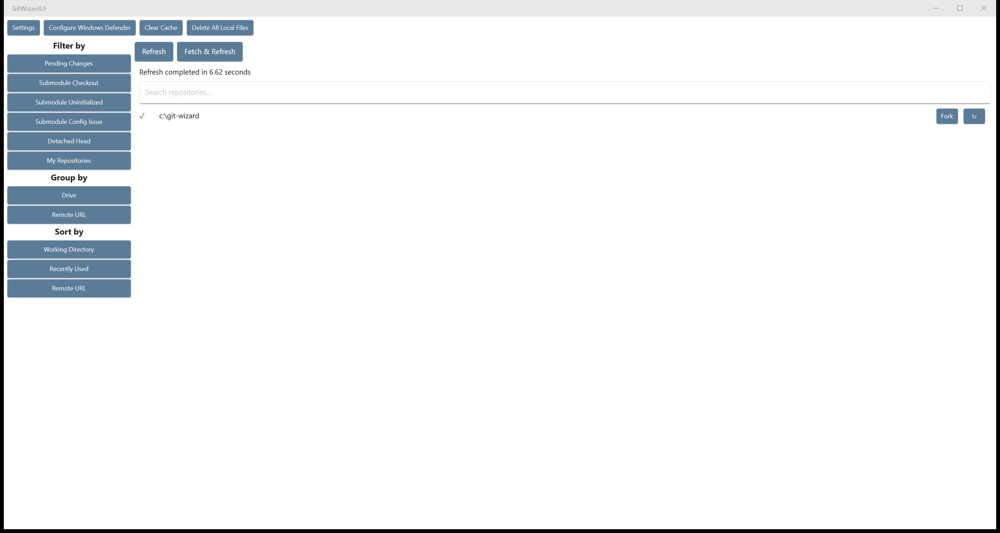

# GitWizard

Scan, organize, and manage all the git repositories on your machine. Find duplicates, spot uncommitted work, and clean up old project copies.



## Features

- **Fast repository discovery** — uses NTFS MFT parsing on Windows for near-instant scanning across all drives
- **Status at a glance** — see pending changes, unpushed commits, and errors per repo
- **Filter** by pending changes, detached heads, submodule issues, or repos you've committed to
- **Group** by drive or remote URL to find duplicate clones
- **Sort** by path, last commit date, or remote URL
- **Search** to quickly find repos by path
- **Deep refresh** per repo with remote fetch and index update
- **Cross-platform desktop** — Avalonia app runs natively on Windows, macOS, and Linux; .NET MAUI app for Windows; library and CLI run everywhere

## Getting Started

Download the latest release from the [Releases](https://github.com/mtschoen/git-wizard/releases) page, or build from source:

```bash
# CLI
dotnet build git-wizard/git-wizard.csproj

# Avalonia desktop (Windows / macOS / Linux)
dotnet build GitWizardAvalonia/GitWizardAvalonia.csproj

# MAUI UI (Windows)
dotnet build GitWizardUI/GitWizardUI.csproj -f net10.0-windows10.0.19041.0
```

On first run, configure your search paths in Settings. GitWizard will scan those paths for git repositories and cache the results for fast subsequent launches.

## Projects

| Project | Description |
|---------|-------------|
| **GitWizard/** | Core class library (cross-platform) |
| **git-wizard/** | CLI tool |
| **GitWizardUI.ViewModels/** | Shared view models for both desktop apps |
| **GitWizardAvalonia/** | Avalonia desktop app (Windows, macOS, Linux) |
| **GitWizardUI/** | .NET MAUI desktop app (Windows) |

## License

See [LICENSE](LICENSE) for details.
